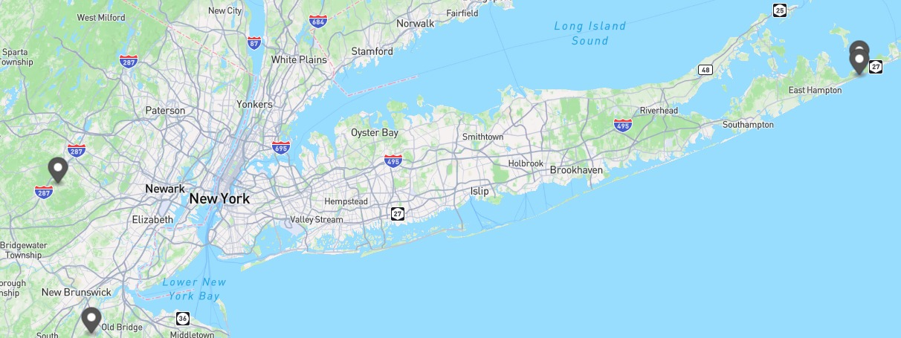
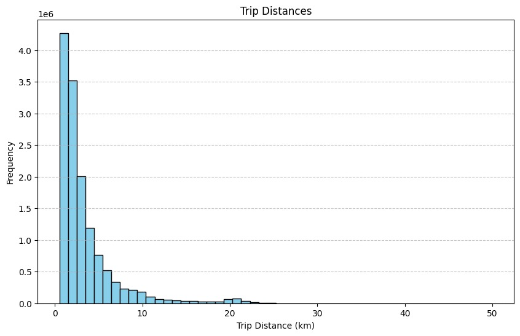
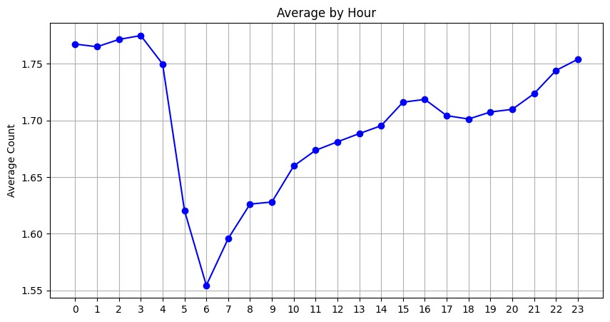
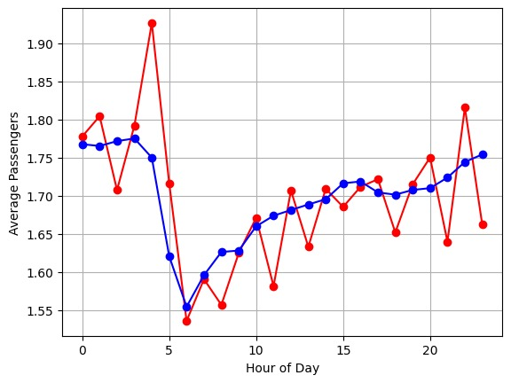

# Trip Data Analysis README

This project involves analyzing a dataset containing taxi trip information. The data includes trip details such as pickup and dropoff locations, timestamps, passenger counts, trip distances, and more. Below is an overview of the dataset, its fields, and the steps taken to analyze it.

## Dataset Overview

The dataset consists of **14,776,615 rows** of trip data covering the period from **2013-01-01 00:00:00** to **2013-02-01 10:33:08**. The data includes information such as taxi medallion, vendor ID, pickup/dropoff timestamps, passenger count, trip distance, and geographic coordinates.

### Dataset Fields

The dataset contains the following fields:

| **Field Name**            | **Description**                                       |
|---------------------------|-------------------------------------------------------|
| `medallion`                | Unique identifier for the taxi medallion.             |
| `hack_license`             | Unique license for the taxi.                          |
| `vendor_id`                | ID of the taxi vendor.                                |
| `rate_code`                | Code indicating the rate category for the trip.       |
| `store_and_fwd_flag`       | Flag indicating if the trip data was stored and forwarded. |
| `pickup_datetime`          | Datetime when the trip started.                       |
| `dropoff_datetime`         | Datetime when the trip ended.                         |
| `passenger_count`          | Number of passengers in the taxi.                     |
| `trip_time_in_secs`        | Trip duration in seconds.                             |
| `trip_distance`            | Trip distance in miles.                               |
| `pickup_longitude`         | Longitude of pickup location.                         |
| `pickup_latitude`          | Latitude of pickup location.                          |
| `dropoff_longitude`        | Longitude of dropoff location.                        |
| `dropoff_latitude`         | Latitude of dropoff location.                         |

### Data Types

Below are the recommended MySQL data types for each field:

| **Field Name**            | **Suggested MySQL Data Type**                           |
|---------------------------|---------------------------------------------------------|
| `medallion`                | VARCHAR(32)                                              |
| `hack_license`             | VARCHAR(32)                                              |
| `vendor_id`                | VARCHAR(3)                                               |
| `rate_code`                | INT(2)                                                   |
| `store_and_fwd_flag`       | CHAR(1)                                                  |
| `pickup_datetime`          | DATETIME                                                 |
| `dropoff_datetime`         | DATETIME                                                 |
| `passenger_count`          | INT(2)                                                   |
| `trip_time_in_secs`        | INT(6)                                                   |
| `trip_distance`            | DECIMAL(5,2)                                             |
| `pickup_longitude`         | DECIMAL(9,6)                                             |
| `pickup_latitude`          | DECIMAL(9,6)                                             |
| `dropoff_longitude`        | DECIMAL(9,6)                                             |
| `dropoff_latitude`         | DECIMAL(9,6)                                             |

## Geographic Bounds

The geographic coordinates are bounded as follows:

- **Pickup Latitude**: 40.400002 to 41.019676
- **Pickup Longitude**: -74.398537 to -72.050003
- **Dropoff Latitude**: 40.75 to 41.0
- **Dropoff Longitude**: -74.499222 to -72.050003

This data can be plotted on a map for visualization.

## Analysis Results

##  Distinct Values

The following fields have distinct values:
- `medallion`: 13,426 unique values
- `hack_license`: 32,224 unique values
- `vendor_id`: 2 unique values
- `rate_code`: 14 unique values
- `store_and_fwd_flag`: 2 unique values
- `pickup_datetime`: 2,303,465 unique values
- `dropoff_datetime`: 2,305,816 unique values
- `passenger_count`: 10 unique values
- `trip_time_in_secs`: 6,594 unique values
- `trip_distance`: 4,368 unique values

### Min/Max Values

Below are the min and max values for key numeric fields:

| **Field Name**         | **Min Value**    | **Max Value**    |
|------------------------|------------------|------------------|
| `passenger_count`      | 0                | 255              |
| `trip_time_in_secs`    | 0                | 10,800           |
| `trip_distance`        | 0                | 100              |

### Average Trip Distance

The **average trip distance** is approximately **3.37 km** based on the filtered data.

### Trip Distance Histogram

A histogram of the trip distances can be found in the project output (refer to images for visualization).

### Average Passengers Per Hour

The average number of passengers per hour of the day was computed and visualized. The chart is available in the project output.

### Reduced Dataset

A reduced dataset (1 out of every 1000 rows) was generated and analyzed. A comparison of the analysis results from the reduced dataset versus the full dataset can be found in the project output (refer to the corresponding chart).

## Data Files

This project utilizes the **trip data CSV** file, which includes the raw data. A sample dataset is available for review, and the full dataset can be processed as needed.
